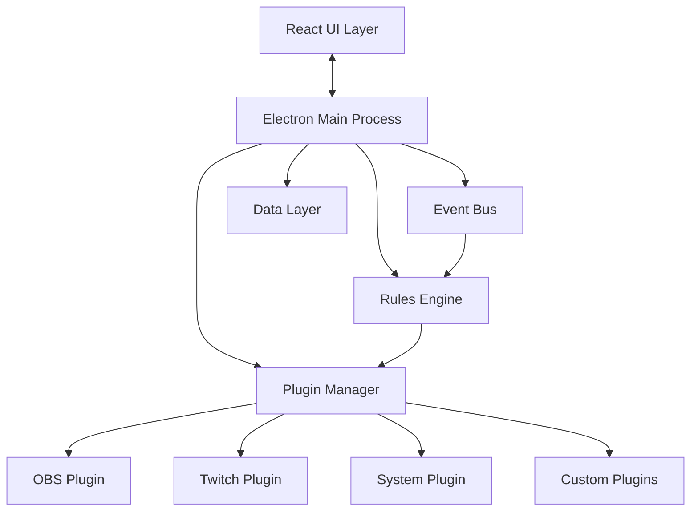
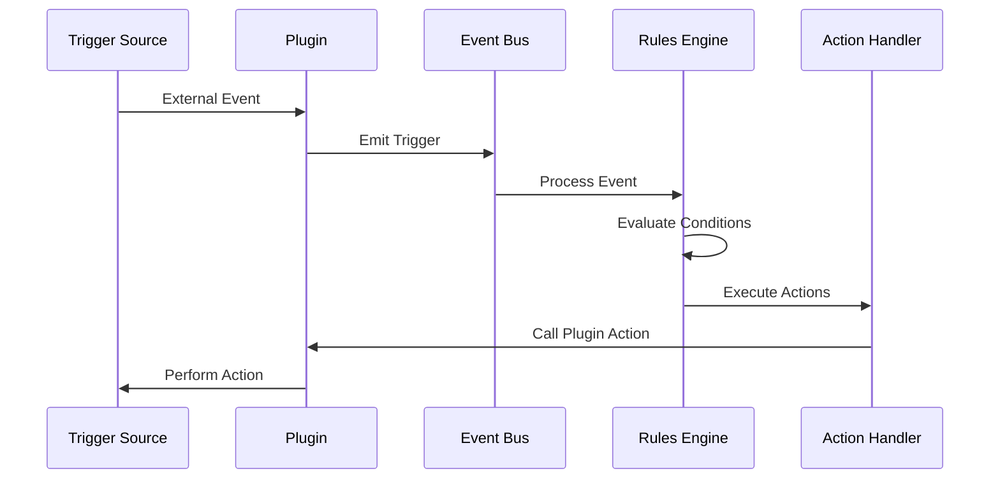

# Juju22 - Design Document

## Executive Summary

**Juju22** is a cross-platform automation and integration platform for content creators and streamers, inspired by Aitum. It provides a plugin-based architecture that enables users to create sophisticated automation rules by connecting triggers from various sources (Twitch events, OBS scenes, hotkeys, webhooks) to actions across different platforms and services.

The application features a visual rule builder, allowing non-technical users to create complex automation workflows through an intuitive GUI, while also providing a robust plugin SDK for developers to extend functionality.

## Table of Contents

1. [Project Overview](#project-overview)
2. [Core Features](#core-features)
3. [Technical Architecture](#technical-architecture)
4. [Technology Stack](#technology-stack)
5. [Project Plan](#project-plan)
6. [Testing Strategy](#testing-strategy)
7. [Success Criteria](#success-criteria)
8. [Risk Analysis](#risk-analysis)

## Project Overview

### Vision
Create the most extensible and user-friendly automation platform for content creators, enabling them to focus on creating content while Juju22 handles repetitive tasks and viewer interactions.

### Target Users
- **Primary**: Streamers on Twitch/YouTube/Kick
- **Secondary**: Content creators, podcast producers, virtual event hosts
- **Tertiary**: Power users wanting general desktop automation

### Key Differentiators
- **Plugin-first architecture**: Everything is a plugin, even core functionality
- **Visual rule builder**: No coding required for complex automations
- **Cross-platform native**: Electron-based, runs on Windows and macOS
- **Real-time event processing**: Sub-50ms latency for trigger-to-action
- **Sandboxed plugins**: Crashed plugins don't affect system stability

## Core Features

### Plugin System
- **Dynamic loading**: Hot-reload plugins without restarting
- **Manifest-based**: JSON/YAML configuration for plugin metadata
- **Sandboxed execution**: Plugins run in isolated contexts
- **Version management**: Automatic updates and compatibility checks
- **Status telemetry**: Plugins publish connection health events for UI surfaces
- **Scoped storage**: Per-plugin config and encrypted secret stores managed by the runtime

### Rule Engine
- **Visual builder**: Drag-and-drop interface for rule creation
- **Conditional logic**: IF/THEN/ELSE branching
- **Variables**: Global and context-specific variable support
- **Action chains**: Sequential and parallel action execution
- **Delays and scheduling**: Time-based trigger delays

### Built-in Plugins

#### System Plugin
- Hotkey triggers and actions
- File system watchers
- HTTP webhooks (incoming/outgoing)
- Timers and schedules (cron-based)
- System notifications

#### OBS Plugin
- **Triggers**: Scene changes, stream start/stop, recording events
- **Actions**: Scene switching, source visibility, filter controls, recording management
- **Connection**: WebSocket with auto-reconnect
- **Phase 2 status**: Ships with a mock runtime that simulates scene changes and stream state while the real WebSocket client is under development.

#### Twitch Plugin
- **Triggers**: Chat commands, follows, subscriptions, raids, channel point redemptions
- **Actions**: Send messages, create clips, update stream info, manage VIPs/mods
- **Authentication**: OAuth 2.0 flow with token refresh
- **Phase 2 status**: Provides a mock EventSub loop that emits chat messages and supports chat/shoutout actions for automation testing.

### User Interface
- **Dashboard**: Live event feed, system status, quick stats
- **Rule Manager**: Create, edit, test, import/export rules
- **Plugin Store**: Browse, install, rate community plugins
- **Settings**: Global preferences, backup/restore, themes
- **Debug Console**: Real-time event monitoring, performance metrics

## Technical Architecture

### System Architecture



### Data Flow



### Plugin Structure

```typescript
interface Plugin {
  manifest: PluginManifest
  initialize(): Promise<void>
  destroy(): Promise<void>

  // Trigger handling
  registerTriggers(): TriggerDefinition[]
  startListening(): void
  stopListening(): void

  // Action handling
  registerActions(): ActionDefinition[]
  executeAction(actionId: string, params: any): Promise<void>

  // Configuration
  getConfigSchema(): JSONSchema
  validateConfig(config: any): ValidationResult
}
```

### File Structure

```
juju22/
├── src/
│   ├── main/              # Electron main process
│   │   ├── core/           # Core engine
│   │   │   ├── plugin-manager.ts
│   │   │   ├── rules-engine.ts
│   │   │   ├── event-bus.ts
│   │   │   └── storage.ts
│   │   ├── api/            # API integrations
│   │   └── ipc/            # IPC handlers
│   ├── renderer/           # React UI
│   │   ├── components/
│   │   ├── pages/
│   │   ├── hooks/
│   │   └── store/
│   ├── plugins/            # Built-in plugins
│   │   ├── system/
│   │   ├── obs/
│   │   └── twitch/
│   └── shared/             # Shared types/utils
├── plugins-external/       # User plugins directory
├── tests/
│   ├── unit/
│   ├── integration/
│   └── e2e/
└── docs/
```

## Technology Stack

### Core Technologies
- **Runtime**: Electron 28+ with Node.js 20+
- **Language**: TypeScript 5.3+
- **UI Framework**: React 18 with Vite
- **State Management**: Zustand
- **Styling**: Tailwind CSS + shadcn/ui

### Development Tools
- **Build**: electron-builder, Vite
- **Testing**: Vitest (unit), Playwright (E2E)
- **Linting**: ESLint, Prettier
- **CI/CD**: GitHub Actions

### Data & Communication
- **Storage**: SQLite (rules/configs), electron-store (settings)
- **IPC**: Electron IPC for main/renderer
- **Networking**: Axios (HTTP), ws (WebSocket)
- **Events**: EventEmitter3

### Security
- **Sandboxing**: Node VM for plugins
- **Authentication**: OAuth 2.0, secure token storage
- **Updates**: electron-updater with code signing
- **Permissions**: Context isolation, limited node integration

## Project Plan

## Phase 1: Foundation (Week 1-2)

### Setup & Architecture
- [ ] Initialize Electron + TypeScript + React project (use Electron Forge or Vite)
- [ ] Set up hot reload, debugging, and build pipeline
- [ ] Create basic window management and app menu
- [ ] Implement data persistence layer (electron-store for settings, SQLite for rules/configs)

### Core Plugin System
- [ ] Define plugin interface and manifest schema
- [ ] Build plugin loader (scan directories, validate manifests, load modules)
- [ ] Implement plugin sandboxing (Node VM or Worker Threads)
- [ ] Create plugin <-> main process communication bridge

### Testing - Phase 1
- [ ] **Unit Tests**:
  - Plugin manifest validation (valid/invalid schemas)
  - Plugin loader with mock plugins
  - Data persistence CRUD operations
  - IPC communication between main/renderer
- [ ] **Integration Tests**:
  - Electron app launches and creates window
  - Plugin discovery from filesystem
  - Plugin loading and initialization sequence
  - Settings persist across app restarts
- [ ] **Test Infrastructure**:
  - Set up Vitest for unit tests
  - Configure Playwright for E2E tests
  - Add test coverage reporting (aim for >80%)
  - Create mock plugin fixtures for testing

## Phase 2: Core Engine (Week 3-4)

### Event System
- [ ] Implement central event bus (EventEmitter)
- [ ] Create trigger registration system
- [ ] Build action execution pipeline with error handling
- [ ] Add event logging and debugging tools

### Rules Engine
- [ ] Design rule data model
- [ ] Build rule evaluation engine
- [ ] Implement condition system (AND/OR logic, comparisons)
- [ ] Add action chaining and delays

### Testing - Phase 2
- [ ] **Unit Tests**:
  - Event bus subscription/unsubscription
  - Trigger firing and event propagation
  - Rule condition evaluation (all operators)
  - Action queue and execution order
  - Delay and timeout handling
- [ ] **Integration Tests**:
  - End-to-end rule execution flow
  - Multiple rules with same trigger
  - Action failure handling and recovery
  - Rule enable/disable functionality
  - Circular dependency detection
- [ ] **Performance Tests**:
  - Load test with 1000+ rules
  - Event throughput (events/second)
  - Memory leak detection during long runs
  - Rule evaluation performance benchmarks

## Phase 3: First Plugins (Week 5-6)

### System Plugin
- [ ] Hotkey triggers
- [ ] Timer/Schedule triggers
- [ ] File watcher triggers
- [ ] HTTP webhook receiver

### OBS Plugin
- [ ] Integrate obs-websocket library
- [ ] Implement core triggers (scene change, stream start/stop, source visibility)
- [ ] Implement actions (switch scene, toggle source, set text, etc.)
- [ ] Handle connection management and auto-reconnect

### Twitch Plugin
- [ ] Set up Twitch OAuth flow
- [ ] Integrate Twitch API and EventSub
- [ ] Triggers: follows, subs, raids, channel points, chat commands
- [ ] Actions: send chat message, create clip, update title/game

### Testing - Phase 3
- [ ] **Unit Tests per Plugin**:
  - Mock external APIs (OBS WebSocket, Twitch API)
  - Test each trigger detection logic
  - Test each action execution
  - OAuth flow with mock responses
  - Reconnection logic and backoff strategies
- [ ] **Integration Tests**:
  - Real OBS connection (test environment)
  - Twitch test account with sandbox events
  - Hotkey registration and cleanup
  - File watcher resource management
  - Webhook endpoint security
- [ ] **Error Scenario Tests**:
  - Network disconnection handling
  - Invalid API credentials
  - Rate limiting responses
  - Malformed webhook payloads
  - Plugin crash recovery
- [ ] **Cross-Plugin Tests**:
  - Twitch event → OBS action chains
  - Multiple plugins responding to same hotkey
  - Plugin interdependencies

## Phase 4: GUI Development (Week 7-8)

### Main Interface
- [ ] Dashboard with system status and recent events
- [ ] Plugin manager (install, enable/disable, configure)
- [ ] Rules builder with drag-and-drop or visual flow
- [ ] Live event monitor/debugger

### Rule Builder
- [ ] Visual rule creation interface
- [ ] Trigger selection and configuration
- [ ] Condition builder with logical operators
- [ ] Action chain builder with reordering
- [ ] Test/simulate rule execution

### Plugin Configuration
- [ ] Auto-generate config forms from JSON Schema
- [ ] Connection testing and validation
- [ ] Plugin-specific UI injection points

### Testing - Phase 4
- [ ] **Component Tests**:
  - React component rendering
  - Form validation and error states
  - Drag-and-drop functionality
  - State management flows
- [ ] **E2E UI Tests (Playwright)**:
  - Complete rule creation workflow
  - Plugin installation and configuration
  - Dashboard real-time updates
  - Rule modification and deletion
  - Keyboard navigation accessibility
- [ ] **Visual Regression Tests**:
  - Screenshot comparisons for UI components
  - Theme switching (if applicable)
  - Responsive layouts at different window sizes
- [ ] **Usability Tests**:
  - Time to create first rule
  - Error message clarity
  - Undo/redo functionality
  - Form autosave behavior

## Phase 5: Advanced Features (Week 9-10)

### Variables & Context
- [x] Global variables system
- [x] Trigger context passing (e.g., username from Twitch event)
- [x] Variable interpolation in action parameters
- [x] Custom user variables and counters

### Advanced Actions
- [x] Conditional branching (if/else in action chains)
- [x] Loops and batch operations
- [x] Random selection from action groups
- [x] External script execution

### Plugin Development
- [x] Plugin development documentation
- [x] TypeScript type definitions package
- [x] Plugin template/generator
- [x] Local plugin development mode

## Phase 5.5: Data Migration & Upgrade Framework (Week 10-11)

### Objectives
- Replace repository-level `CREATE TABLE` calls with a versioned migration runner that owns schema creation and evolution.
- Establish a baseline migration so fresh installs and future upgrades follow the same path.

### Migration Runtime
- [ ] Implement `MigrationRunner` with ordered modules, transactional execution, and structured logging.
- [ ] Create `schema_migrations` metadata table to record applied migration IDs and timestamps.
- [ ] Emit migration lifecycle events over the `EventBus` for renderer visibility.
- [ ] Fail-safe: abort startup (with clear error) if a migration fails mid-flight.

### Initial Migrations
- [ ] `0001_initial_schema`: build `rule_definitions` and `variables` tables matching the current runtime schema.
- [ ] `0002_seed_variable_defaults`: ensure newly introduced variable scopes have predictable defaults.
- [ ] Wire migrations to execute before plugin loading and rule evaluation.

### Tooling & Tests
- [ ] Unit tests covering migration ordering, idempotency, and rollback behavior.
- [ ] Integration test that boots a fresh install via migrations and validates schema availability.
- [ ] CLI task `npm run migrate:plan` to preview pending migrations and `npm run migrate:apply` for manual execution.

### Developer Workflow
- [ ] Authoring guide in `docs/migrations.md` detailing conventions and review checklist.
- [ ] CI step to run migrations against ephemeral fixtures to catch schema drift early.
- [ ] Lint rule or PR checklist ensuring schema changes ship with migrations.

### Testing - Phase 5
- [ ] **Unit Tests**:
  - Variable interpolation engine
  - Context passing between triggers/actions
  - Conditional logic evaluation
  - Loop iteration limits
  - Script sandboxing security
- [ ] **Integration Tests**:
  - Complex multi-branch rule flows
  - Variable persistence across app restarts
  - Counter increment race conditions
  - External script timeout handling
- [ ] **Plugin SDK Tests**:
  - Generate plugin from template
  - Type definition completeness
  - Development mode hot reload
  - Plugin validation against schema
- [ ] **Security Tests**:
  - Script injection attempts
  - Path traversal in file operations
  - Variable content sanitization
  - Plugin permission boundaries

## Phase 6: Polish & Distribution (Week 11-12)

### Performance & Reliability
- [ ] Implement circuit breakers for failing plugins
- [ ] Add retry logic with exponential backoff
- [ ] Memory leak detection and prevention
- [ ] Performance profiling and optimization

### User Experience
- [ ] Onboarding wizard for first-time setup
- [ ] Import/export rules and configurations
- [ ] Backup and restore functionality
- [ ] Comprehensive error messages and recovery

### Distribution
- [ ] Auto-updater implementation
- [ ] Code signing for Windows and macOS
- [ ] Create installers (MSI/exe for Windows, DMG for macOS)
- [ ] Plugin marketplace/registry infrastructure

### Testing - Phase 6
- [ ] **System Tests**:
  - Full installation on clean Windows/macOS
  - Auto-update from previous version
  - Migration of settings/rules
  - Uninstallation cleanup
- [ ] **Stress Tests**:
  - 24-hour continuous operation
  - Maximum concurrent plugins (50+)
  - 10,000+ events per minute
  - Memory usage over time
  - CPU usage under load
- [ ] **Compatibility Tests**:
  - Windows 10/11 variations
  - macOS versions (last 3 major)
  - Different screen resolutions/DPIs
  - Antivirus software compatibility
- [ ] **Recovery Tests**:
  - Corrupted configuration recovery
  - Partial plugin failure handling
  - Database corruption recovery
  - Network interruption resilience
- [ ] **User Acceptance Tests**:
  - Beta tester feedback integration
  - Common workflow completion rates
  - Error message comprehension
  - Performance on minimum spec hardware

## Testing Strategy

### Continuous Testing Practices
- **Pre-commit hooks**: Run unit tests before allowing commits
- **Static analysis**: `npm run lint` must pass with zero warnings before changes ship (CI blocks merges if ESLint fails)
- **Type checks**: `npx tsc` must pass
- **CI/CD Pipeline**:
  - Run all tests on PR creation
  - Nightly E2E test runs
  - Weekly stress tests
  - Performance regression detection
- **Test Documentation**:
  - Test plan for each feature
  - Bug reproduction steps
  - Test data management strategy
  - Test environment specifications

### Testing Metrics to Track
- Code coverage (target: >80% for core, >90% for critical paths)
- Test execution time (<5 min for unit, <20 min for E2E)
- Defect escape rate to production
- Mean time to detect/resolve issues
- Performance benchmarks per release

### Test Environment Setup
- Mock OBS instance for testing
- Twitch sandbox account with test tokens
- Isolated test database
- Network simulation for latency/disconnection
- Multiple OS VMs for compatibility testing

## Success Criteria

### Technical Metrics
- **Performance**:
  - Plugin load time: <100ms
  - Rule execution latency: <50ms
  - Memory usage: <200MB baseline
  - CPU usage when idle: <1%
  - Event throughput: >1000 events/second

- **Reliability**:
  - Core engine uptime: 99.9%
  - Plugin crash isolation: 100%
  - Data loss prevention: Zero data loss on crash
  - Auto-recovery time: <5 seconds

### User Experience Metrics
- **Adoption**:
  - Time to first rule: <5 minutes
  - Daily active users: 10,000+ (Year 1)
  - Plugin installations: 100,000+ (Year 1)
  - Community plugins: 50+ (6 months)

- **Quality**:
  - Crash rate: <0.1% of sessions
  - User-reported bugs: <10 per release
  - App store rating: 4.5+ stars
  - Support ticket resolution: <24 hours

### Business Metrics
- **Development**:
  - Release cadence: Monthly updates
  - Feature delivery: 90% on-time
  - Technical debt ratio: <20%
  - Documentation coverage: 100%

## Risk Analysis

### Technical Risks

| Risk | Impact | Probability | Mitigation |
|------|--------|-------------|------------|
| Plugin crashes affect stability | High | Medium | Sandboxing, process isolation |
| API rate limiting | Medium | High | Caching, queuing, backoff strategies |
| Memory leaks in long-running sessions | High | Low | Profiling, automated testing |
| Complex rules causing performance issues | Medium | Medium | Rule complexity limits, optimization |

### External Risks

| Risk | Impact | Probability | Mitigation |
|------|--------|-------------|------------|
| Platform API changes | High | Medium | Abstraction layers, version pinning |
| Competing products | Medium | High | Unique features, better UX |
| Security vulnerabilities | High | Low | Regular audits, sandboxing |
| Open source maintenance burden | Medium | Medium | Clear contribution guidelines |

### Mitigation Strategies
1. **Modular architecture**: Isolate failures to specific components
2. **Comprehensive testing**: Catch issues before production
3. **Active monitoring**: Real-time error tracking and alerting
4. **Community engagement**: Build ecosystem of plugin developers
5. **Regular updates**: Quick response to issues and API changes

## Appendices

### A. Plugin Manifest Schema
```json
{
  "$schema": "http://json-schema.org/draft-07/schema#",
  "type": "object",
  "required": ["id", "name", "version", "author"],
  "properties": {
    "id": { "type": "string", "pattern": "^[a-z0-9-]+$" },
    "name": { "type": "string" },
    "version": { "type": "string", "pattern": "^\\d+\\.\\d+\\.\\d+$" },
    "author": { "type": "string" },
    "description": { "type": "string" },
    "homepage": { "type": "string", "format": "uri" },
    "license": { "type": "string" },
    "main": { "type": "string" },
    "triggers": { "type": "array" },
    "actions": { "type": "array" },
    "configSchema": { "type": "object" },
    "permissions": { "type": "array" },
    "dependencies": { "type": "object" }
  }
}
```

### B. Example Rule Configuration
```yaml
id: welcome-new-follower
name: Welcome New Followers
enabled: true
trigger:
  plugin: twitch
  event: follow
  config:
    channel: my-channel
conditions:
  - type: time
    operator: between
    value: ["18:00", "23:00"]
actions:
  - plugin: obs
    action: show-source
    config:
      scene: Main
      source: NewFollowerAlert
      duration: 5000
  - plugin: twitch
    action: send-message
    config:
      message: "Thanks for the follow, {username}!"
    delay: 1000
```

### C. Development Timeline

| Milestone | Date | Deliverables |
|-----------|------|--------------|
| MVP | Week 4 | Core engine, basic plugins, CLI interface |
| Alpha | Week 8 | Full GUI, 3 plugins, visual rule builder |
| Beta | Week 10 | All features, plugin SDK, documentation |
| RC | Week 11 | Performance optimized, installers ready |
| 1.0 | Week 12 | Public release, plugin marketplace |

---

## Document History

| Version | Date | Author | Changes |
|---------|------|--------|---------|
| 1.0 | 2024-12-XX | Team | Initial design document |

---

*This is a living document and will be updated as the project evolves.*
